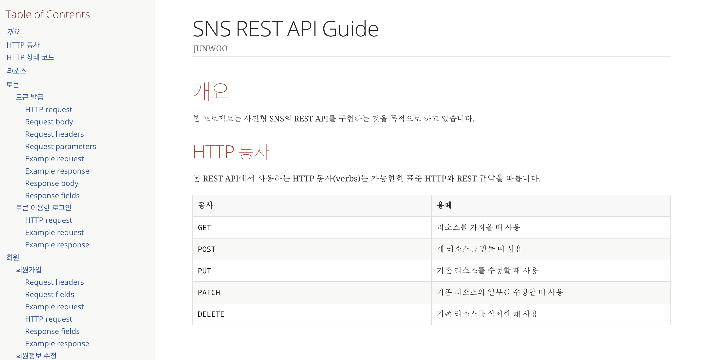

# Spring Boot 를 이용한 사진 SNS REST API 서버
[](https://travis-ci.org/junwoochoi/spring-boot-practice)[](https://coveralls.io/github/junwoochoi/spring-boot-practice?branch=master)

사진형 SNS 서비스인 인스타그램을 참고하여 만드는 Spring Boot 서비스 입니다.

~[SNS REST API GUIDE 링크]~


## 개발환경


- Spring Boot
- JPA
- Postgresql
- H2
- Lombok
- JUnit
- Spring REST Docs     

을 사용중입니다.

요청시 JSON 형태로 요청결과를 리턴해주고 있습니다.

TDD를 부분적으로 적용하여 개발중입니다. 


## 진행 상황

- [x] SpringSecurity를 이용하여 AccessToken과 RefreshToken 발급 및 조회

- [x] JPA 를 이용한 게시글 및 댓글 작성, 조회, 페이징 처리

- [x] S3에 static Image 업로드 및 관리

- [x] Test코드를 꾸준히 작성하여 Coverage 75퍼센트 이상 유지

- [x] Travis CI를 이용한 코드 관리

- [x] 개인 도메인 및 HTTPS 적용

- [x] Nginx 프록시와 AWS Codedeploy를 이용하여 무중단 배포 적용

- [ ] Docker 적용

- [ ] 계층형 구조를 이용한 대댓글 구현

- [ ] 해시태그를 이용한 검색


  

## 프로젝트 실행환경

- maven이 설치되어 있어야 합니다.

- Lombok이 설치되어 있어야 합니다.

- application.yml 의 datasource를 본인의 로컬 디비로 변경해야 합니다.

  

### 실행

```shell
$ mvn spring-boot:run
```


### SNS REST API GUIDE

- 해당 API는 RestDocs로 작성된 가이드를 보고 테스트 할 수 있습니다.



